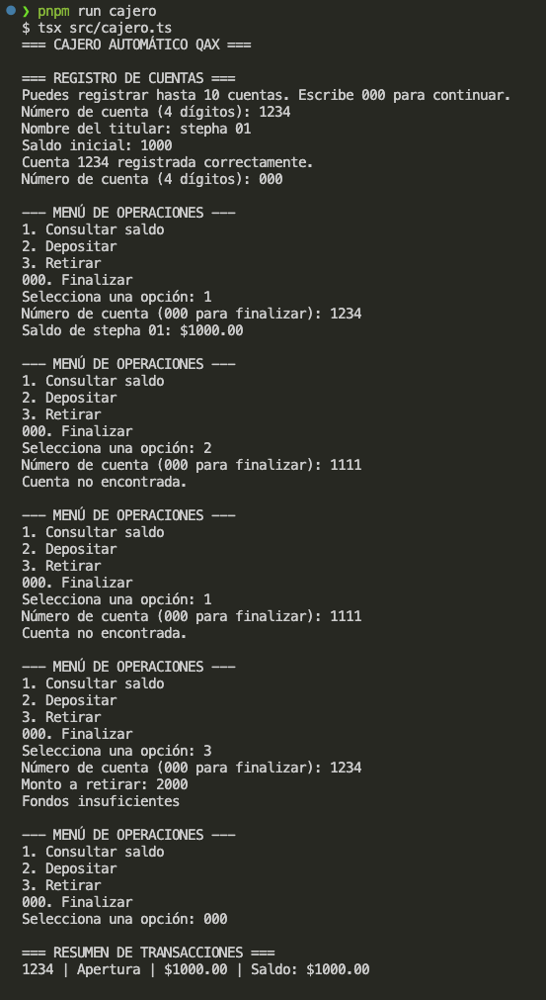

# Playwright Quick task QAX Cajero

Proyecto principal del Warmup para desarrollar el simulador de cajero automatico usando TypeScript y la consola.

Este proyecto contiene:

- `src/cajero.ts`: taller real solicitado en el ejercicio.
- `src/calculadora-cafe.ts`: ejemplo de referencia usado para entender la estructura.

## Objetivo

Completar el taller del cajero automatico practicando los conceptos basicos de TypeScript que aparecen en el material.

## Estructura

```text
playwright-warmup-qax-cajero/
├── src/
│   ├── calculadora-cafe.ts
│   └── cajero.ts
├── evidence/
├── .gitignore
├── package.json
├── pnpm-workspace.yaml
├── tsconfig.json
└── README.md
```

| Archivo o carpeta | Uso |
|---|---|
| `src/cajero.ts` | Contiene el taller real del cajero automatico. |
| `src/calculadora-cafe.ts` | Ejemplo de referencia del material. |
| `evidence/` | Guarda los pantallazos de la ejecucion del cajero desde la terminal. |
| `package.json` | Guarda los comandos y dependencias de TypeScript. |
| `tsconfig.json` | Configura TypeScript para los archivos de `src/`. |

## Requisitos del taller

1. Solicitar datos por consola usando `readline`.
2. Registrar hasta 10 cuentas bancarias.
3. Guardar numero de cuenta de 4 digitos, titular y saldo inicial.
4. Consultar saldo.
5. Depositar dinero.
6. Retirar dinero validando el saldo.
7. Finalizar cuando se escriba `000`.
8. Mostrar un resumen de todas las transacciones.
9. Mostrar el total de todas las cuentas al final.

## Reglas de negocio

- Un retiro mayor al saldo muestra `Fondos insuficientes`.
- Un retiro mayor a `$10,000` muestra `Límite de retiro excedido`.
- El saldo no puede ser negativo.
- El total de todas las cuentas se muestra al finalizar.

## Requisitos

- Node.js 18 o superior.
- pnpm.
- Git.
- VS Code u otro editor.

## Instalacion

Desde esta carpeta:

```bash
pnpm install
```

Este proyecto no necesita Playwright porque el taller se ejecuta desde la terminal.

## Comandos

Validar TypeScript:

```bash
pnpm run typecheck
```

Ejecutar la calculadora de cafe de ejemplo:

```bash
pnpm run calculadora
```

Ejecutar el taller real:

```bash
pnpm run cajero
```

Opciones del menu del cajero:

- `1`: consultar saldo.
- `2`: depositar.
- `3`: retirar.
- `000`: finalizar.

## Evidencias




```bash
pnpm run cajero
```

Las evidencias de este proyecto seran solamente las capturas del taller real del cajero. La calculadora de cafe es un ejemplo y no necesita evidencias propias.

## Resultados

| Validacion | Resultado |
|---|---|
| `pnpm run typecheck` | Correcto. |
| `pnpm run cajero` | Se documento con los pantallazos de la terminal. |

## Notas importantes

- `src/cajero.ts` es el ejercicio principal.
- `src/calculadora-cafe.ts` es solo un ejemplo de referencia.
- Las evidencias se guardaran solamente en `evidence/`.
